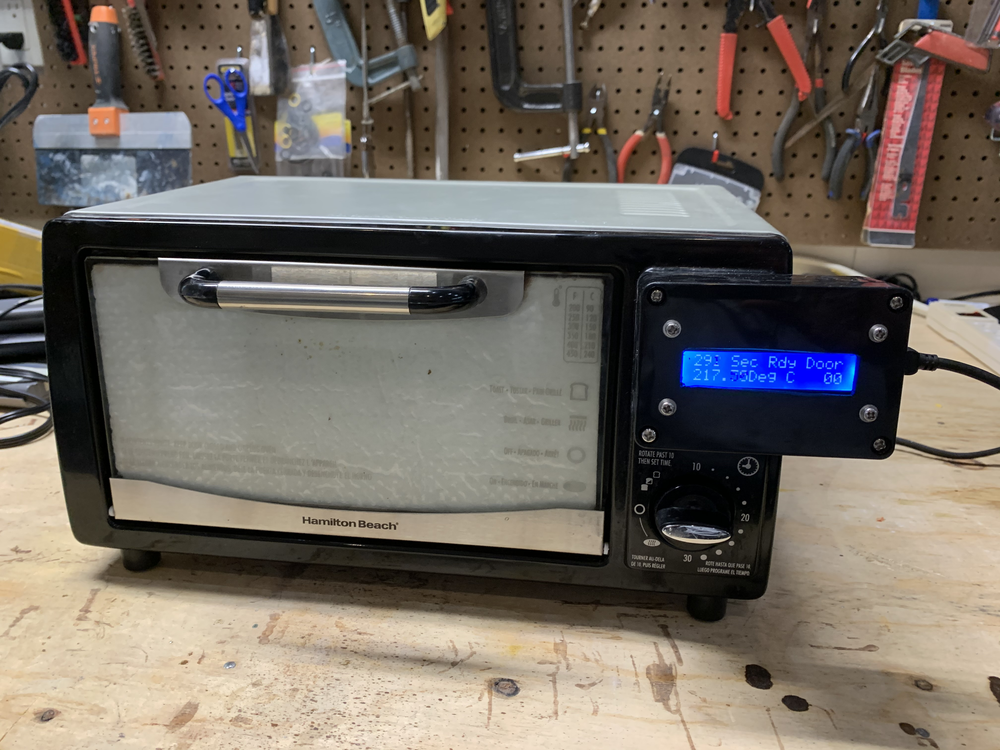

# Reflow_Oven
The PDF describes how to convert a toaster oven into a reflow oven for soldering surface mount devices on circuit boards.
The Arduino code runs on a Nano and controls the oven temperature for a standard tin-lead solder profile.

This project is described at the Arduino Project Hub site below:
https://create.arduino.cc/projecthub/thedalles77/toaster-oven-conversion-to-smd-reflow-oven-60b147
